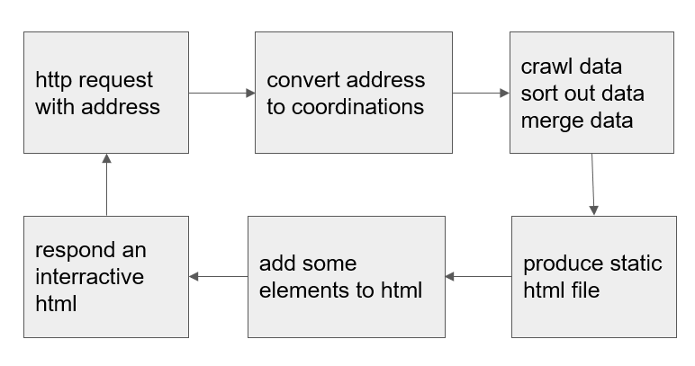

# geographical_mapping_of_COVID-19

## Overview

Implement a web app with “flask” that processes http requests, looks up the coordinates according to the ‘address’ parameter, and creates an interactive html page based on ‘openstreetmap’. With “beautifulsoup” the app crawles coronavirus infected data from sites like CDC of Connecticut, create two data layers above the initial map combining geometric data of the U.S. It implements the drawing of a map with “folium”, processes the data frame with “pandas” and “geopandas”. After saving a static html page, adding some tags on the top of the site allowing users to search other addresses, the app responds to the request with an interactive html page containing map and coronavirus infected information.

 

### Workflow
 

### Convert address to coordinates
- apply a key from bing map
- construct request with parameters
- send http request to dev.virtualearth.net
- get response as json format and parse the contents

```python
    def getGPS(self, address):
        # firstly, get gps
        getVars = {'q': address, 'key': 'Zgc5TVh6cSWvjD9ykosVKeGeiAifT3YZIh8PQSX0p7bMt9g4eRfNr222TrYD6_Nm', 'o': 'json',
                   'jsonso': address, 'jsonp': 'QuickGeocodeCallback', 'gv_nocache': '1587954932688'}

        url = 'https://dev.virtualearth.net/REST/v1/Locations?' + urllib.parse.urlencode(getVars)
        s = requests.Session()
        page = s.get(url)
        if -1 == page.text.find("coordinates"):
            return None
        import json
        a = page.text.index("{")
        b = page.text.rindex("}")
        newDictionary = json.loads(page.text[a:b + 1])
        gps = newDictionary['resourceSets'][0]['resources'][0]['geocodePoints'][0]['coordinates']
        return gps

```
### Data Process
- geopandas: read geometric data from json file. The data includes the states of U.S. and 169 towns of connecticut.
- pandas: get coronovirus infected information from CDC of U.S. and connecticut.
- Merge pandas data to geopandas

```python
    # create map of CT
    def createCTMap(self, m):
        ct_towns = gpd.read_file("./static/connecticut.geojson", driver='GeoJSON')
        df_towns_init = pd.read_csv("https://stateofhealth.ct.gov/content/covidFiles/town_result.csv?v=1588046443223")
        df_towns_init.columns = ["town_no", "town", "LastUpdateDate", "ConfirmedCases", "Deaths", "CaseRate"]

        dicTown = {}
        li_df_towns = []
        listRows = df_towns_init.to_numpy().tolist()
        for i in listRows:
            dicTown[i[0]] = i
        for i in ct_towns['town_no']:
            li_df_towns.append(dicTown[int(i)])
        df_towns = list(zip(*li_df_towns))
        ct_towns["Date Updated"] = df_towns[2]
        ct_towns["Confirmed Cases"] = df_towns[3]
        ct_towns["Number of Deaths"] = df_towns[4]
        ct_towns["Case Rate per 100,000"] = df_towns[5]

        low, high = ct_towns['Confirmed Cases'].quantile([0.1, 0.9]).apply(lambda a: round(a, 0))

        mean = round(ct_towns['Confirmed Cases'].mean(), 0)
        color_map = branca.colormap.LinearColormap(
            colors=['#f0f0f0', '#c0c0e0', '#9090c0', '#7060b0', '#502080'],
            index=ct_towns['Confirmed Cases'].quantile([0.2, 0.4, 0.6, 0.8]),
            vmin=low,
            vmax=high
        )
        ct_towns_series = ct_towns.set_index('town_no')['Confirmed Cases']
```
### create Leaflet maps with folium library
process and used API
- Construct a map with “openstreetmap” style
  - location
    - coordinate of map
  - name
    - Name of the custom pane. support OpenStreetMap, Mapbox, Cloudmade
  - zoom_start 
    - Initial zoom level for the map
- Marker the address of http request on the map 
- Use function GeoJson creating two data layers: one is u.s. state layer, the other is 169 connecticut towns.
- Manage the two data layers using Layer Control
- Use function GeoJsonTooltip to create pop up tips of infected cronovirus information
- Use FloatImage to float a compass on the map

```python
 def style_function_ct_town(feature):
            clrdata = ct_towns_series.get((feature['properties']['town_no']))
            return {
                'fillColor': '#black' if clrdata is None else color_map(clrdata),
                'color': 'black',
                'weight': 2, 'fillOpacity': 0.5
            }

        # m = folium.Map(location=[41.29061720879303,-72.9614442586898], zoom_start=12)
        # create layer from geojson
        stategeo = folium.GeoJson(ct_towns,
                                  name='Connecticut',
                                  style_function=style_function_ct_town,
                                  tooltip=folium.GeoJsonTooltip(
                                      fields=['town', 'Case Rate per 100,000', 'Confirmed Cases',
                                              'Number of Deaths', 'Date Updated'],
                                      style='display: flex; align-items: center; justify-content: center;',
                                      localize=True)
                                  ).add_to(m)

```
 


